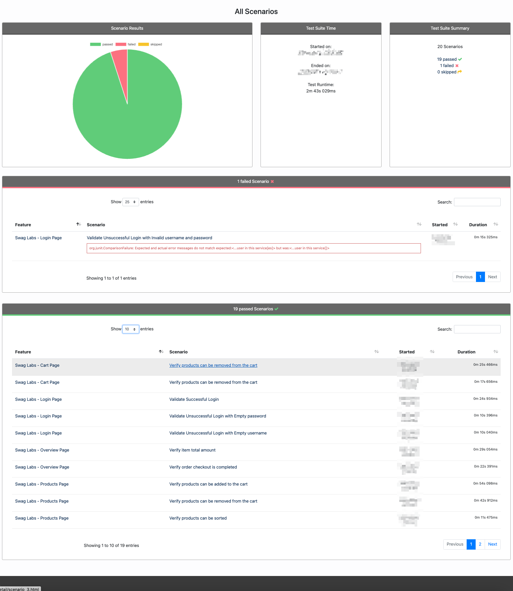
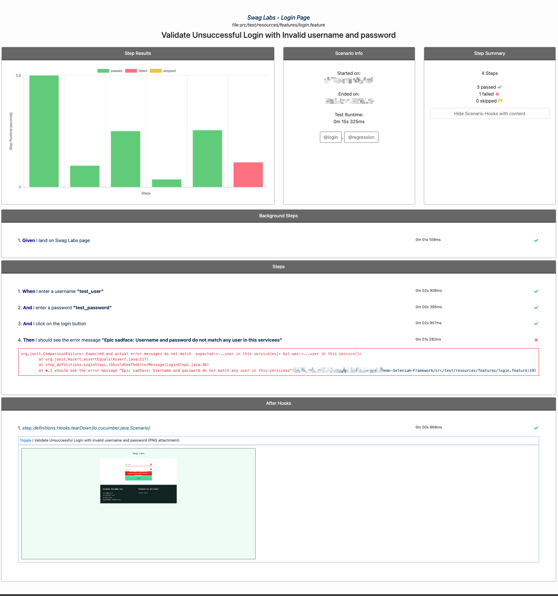
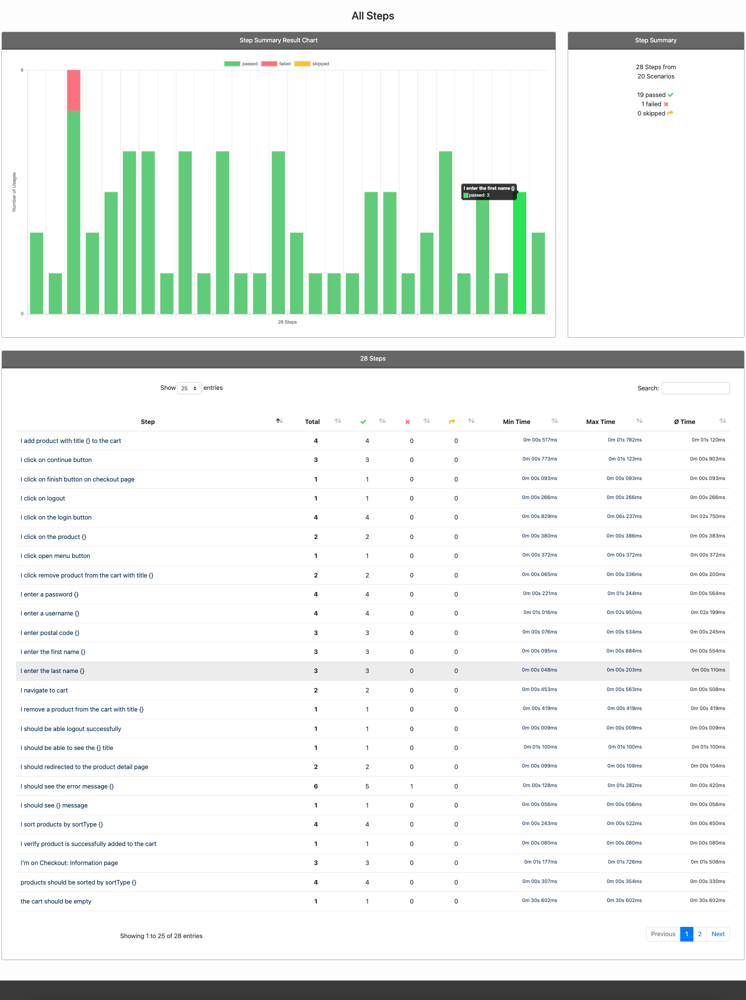

# Demo Selenium Framework

## **General Information**
The Demo Selenium Framework stands at the forefront of test automation by leveraging the capabilities of the latest Selenium version in tandem with Java. This Maven-structured project epitomizes the principles of Behavior-Driven Development (BDD) through its integration with Cucumber. With a concentrated emphasis on automating end-to-end (e2e), smoke, regression, and build acceptance tests (BAT) for UI functionalities, the framework is architectured to run tests in parallel. The incorporation of technologies such as ThreadSafe and the Bill Pugh Singleton Design Pattern underscores its commitment to thread safety. Moreover, the implementation of the Page Object Model ensures that the framework remains flexible, scalable, and most importantly, user-friendly in its code structure.
## Retry Functionality
The framework has a built-in **retry** functionality. If a test case fails unexpectedly, it will automatically be retried, ensuring fewer false negatives. This enhancement ensures the reliability of the test suite and maximizes the efficiency of resource utilization.

## **Prerequisites**
- **IDE**: IntelliJ, Eclipse, VS Code or similar.
- **Java**: Version 17 or higher (Note: Selenium will soon stop supporting JAVA 8).
- **Maven**: Install the latest version and set up the environment variables for Maven.
- **Browser Drivers**: Instead of using WebDriver manager, the framework leverages the latest DriverManager of Selenium, which automatically identifies the browser version and downloads the corresponding driver.
- **IDE Plugins**: Ensure you have Maven and Cucumber plugins installed.

## **Setup & Installation**
1. First, install [Java](https://www.oracle.com/java/technologies/downloads/) and set the path in your environment variables.
2. Install [Maven](https://maven.apache.org/install.html) and set its path in your environment variables.
3. Clone the project from [this link](https://github.com/hkristina/Demo-Selenium-Framework.git).
4. Import the cloned project into your preferred IDE.

## **Running the Tests**
Navigate to the project directory in your terminal or command prompt:

1. Execute a clean install with `mvn clean install`.
2. Run tests with the `mvn test` command.
3. You can specify the browser using the `browser_name` argument. Supported browsers include FIREFOX, CHROME, EDGE, and SAFARI. More browser types can be added as needed.
4. Specify the desired runner/tags using cucumber options. Here are some examples:
    - Run Test Runner: `mvn clean test -Dtest=runner.TestRunner`
    - Run Regression Tag: `mvn clean test -Dtest=runner.TestRunner -Dcucumber.filter.tags="@regression"`
    - Run Multiple Tags: `mvn clean test -Dtest=runner.TestRunner -Dcucumber.filter.tags="@tag1 or @tag2"`
    - Run Features On Parallel:`mvn clean test -Dtest=runner.TestRunner -Dcucumber.filter.tags="@regression" -DthreadCount=4`

### **Rerunning Failed Scenarios**
In cases where some scenarios fail, they'll be documented in the `rerun.txt` file within the `target` folder. There's a designated runner class, `FailedScenariosRunner.java`, which is tailored to rerun specifically the failed scenarios from the prior build. This runner targets the `.txt` file containing details of failed scenarios.
To execute a rerun of the failed scenarios, simply use the following command:
`mvn test -Dtest=runner.FailedScenariosRunner`

## **Report Details**
The framework offers two reporting options:
1. **Default Selenium Report**: Generated automatically post-test execution.
2. **Cluecumber Report**: For a more detailed and visually appealing report, you can use Cluecumber. 
Once your tests have completed and the `cucumber.json` is generated, run this maven mvn `mvn cluecumber:reporting` command to generate the HTML report. The report can be accessed from `target/generated-reports/index.html`. This report provides comprehensive test details, and if a test scenario fails, a screenshot is captured and embedded for better context. Make sure you don't run mvn clean since it will wipe out the cucumber.json and the reports will be empty.
<table style="margin: 0 auto;">
  <tr>
    <td style="text-align:center;">
      <strong>All Scenarios Dashboard</strong> 
      
    </td>
    <td style="text-align:center;">
      <strong>Failed Test Case Screenshot</strong> 
      
    </td>
    <td style="text-align:center;">
      <strong>All Steps Detailed Report</strong> 
      
    </td>
  </tr>
</table>

## **Common Issues & Troubleshooting**
1. **Missing Dependencies**: If encountering errors related to missing libraries or dependencies, ensure that you've run `mvn clean install` to fetch all necessary dependencies.
2. **Browser Driver Issues**: Should a test fail to initiate due to browser driver issues, ensure you have compatible browser versions installed. The DriverManager should handle this, but inconsistencies might occur.
3. **Environment Variables**: Ensure that JAVA_HOME and MAVEN paths are correctly set in the system's environment variables. Incorrect paths can lead to build and test failures.
